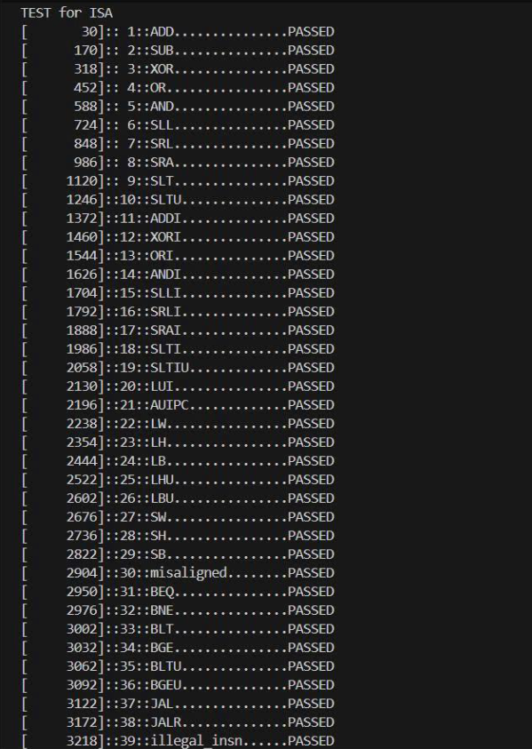
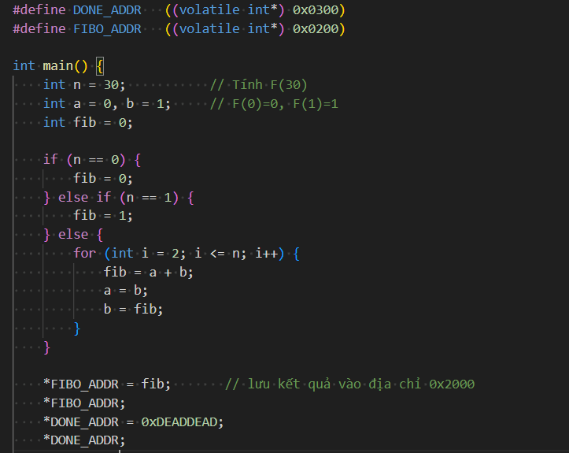
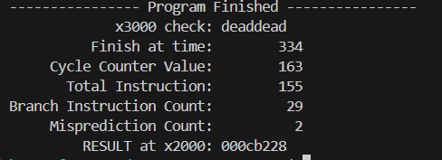

# Design and Implementation of AGREE Branch Predictor in a RISC-V Pipeline

## 1. Project Results:
 This project successfully implemented and integrated the AGREE branch predictor into the FETCH stage of a RISC-V pipeline to resolve negative interference (aliasing)
 
Benchmarking and simulation via Verilator demonstrated that the AGREE model achieves higher accuracy and a near-ideal CPI (Cycles Per Instruction) compared to traditional Bimodal and Gshare predictors

### Specific evaluation metrics include:

**ISA Validation (Instruction Set Architecture):**
 The integrated pipeline successfully executed and passed the RISC-V ISA testbenches, ensuring functional correctness. Simulation results verified 39 fundamental test cases—encompassing Arithmetic, Logical, Load/Store, Branch/Jump operations, and exception handling (`misaligned`, `illegal_insn`)—with all reporting `"PASSED"`. A standard ISA test sequence successfully completed 1115 instructions within 1372 cycles.

 

  

***fibonaci test result***
 

  

 

  

**Nested branch scenario:**
AGREE achieved 77.79% prediction accuracy with a CPI of 1.26, outperforming Gshare (47.00% accuracy, 1.42 CPI) and Bimodal (61.36% accuracy, 1.34 CPI)

***Performance Comparison (Test case: Nested branch)***

| Model (RISC-V pipeline) | Cycle Count | Total Instruction | CPI  | Total Branch | Mispredict | Accuracy (%) |
| :---------------------- | :---------: | :---------------: | :--: | :----------: | :--------: | :----------: |
| Always not taken        | 11507       | 7838              | 1.47 | 2166         | 1333       | 38.46        |
| Bimodal                 | 10515       | 7838              | 1.34 | 2166         | 837        | 61.36        |
| Gshare                  | 11137       | 7838              | 1.42 | 2166         | 1148       | 47.00        |
| **Agree**               | **9850**    | **7838**          | **1.26** | **2166** | **505**    | **77.79**    |

**More stress nested branch scenario:**
AGREE maintained a 71.98% accuracy and a 1.19 CPI, whereas Gshare and Bimodal dropped to 52.68% and 63.81% accuracy, respectively.

***Performance Comparison (Test case: More stress nested branch)***

| Model (RISC-V pipeline) | Cycle Count | Total Instruction | CPI  | Total Branch | Mispredict | Accuracy (%) |
| :---------------------- | :---------: | :---------------: | :--: | :----------: | :--------: | :----------: |
| Always not taken        | 13404       | 9887              | 1.36 | 3377         | 1756       | 48.00        |
| Bimodal                 | 12336       | 9887              | 1.25 | 3377         | 1222       | 63.81        |
| Gshare                  | 13088       | 9887              | 1.32 | 3377         | 1598       | 52.68        |
| **Agree**               | **11860**   | **9887**          | **1.19** | **3377** | **946**    | **71.98**    |

**System impact:** Significantly reduced pipeline flushes and mispredictions, improving the overall execution performance of the RISC-V architecture
.
## 2. Technologies & Tools Used
**Hardware Description Language:** SystemVerilog.

**Simulation & Verification:** Verilator, GTKWave (waveform analysis).

**Toolchain:** RISC-V GNU Toolchain (compiling C programs to hex files for Instruction Memory evaluation).

## 3. Repository Structure
* `source/`: Contains all SystemVerilog RTL files for the RISC-V core and prediction modules.
* `top_riscv_test/`: Testbenches and simulation environment setup.
* `image/`: Contains simulation result captures and architectural diagrams.
* `build/`: Contains compilation artifacts, and Verilator simulation executables (e.g., vtestbench).
* `include/`: Contains header files defining global macros, constants, and configurations for RTL modules and test environments.